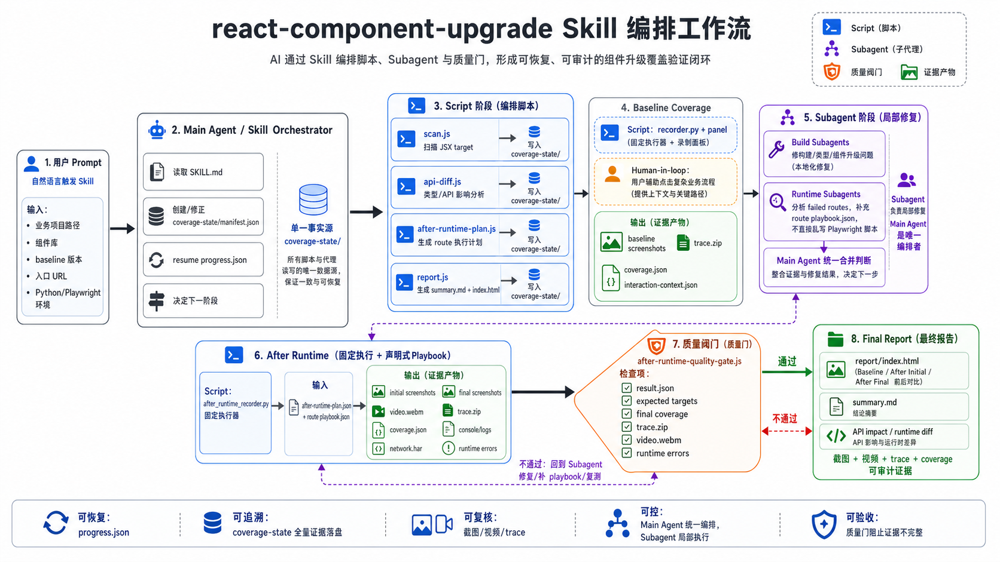

# component-upgrade-coverage-recorder

这个仓库用于生成一个 Codex skill：`react-component-upgrade`。使用者不是直接调用仓库里的 recorder / workflow 脚本，而是在业务项目里启用这个 skill，然后通过 prompt 让 AI 代为完成组件库升级覆盖验证。

## 它解决什么问题

组件库升级时，单靠单测和构建很难证明“业务页面里用到的组件调用点都看过了”。这个 skill 会让 AI 按固定流程做几件事：

- 扫描业务代码里目标组件库的 JSX 调用点。
- 生成需要覆盖的路由和组件目标清单。
- 在升级前版本录制 baseline 覆盖证据。
- 在升级后版本做 after-runtime 验证。
- 收集截图、视频、Playwright trace、coverage、运行时错误和前后对比报告。
- 根据缺失覆盖或异常继续驱动修复和复测。

## 设计亮点

这个项目不是一个单次运行的录屏脚本，而是一个面向 AI 协作的覆盖验证工作流。核心设计是让 AI 可以长时间、可恢复、可审计地推进组件升级验证。

- **Skill-first**：仓库产物是 Codex skill，使用者通过 prompt 交互；底层脚本是 skill 的工具箱，不要求人手动记命令。
- **单一状态目录**：所有阶段都围绕业务项目里的 `coverage-state/` 展开，baseline worktree 也读取同一份 manifest，避免多份状态互相漂移。
- **可恢复流程**：`progress.json` 记录当前阶段和下一步，中断后让 AI 先 resume，再从正确位置继续。
- **目标级覆盖**：扫描 JSX 调用点后生成 route 和 target 清单，验证关注的是“这些组件调用点是否真的在页面运行时出现过”，不是只看页面能否打开。
- **baseline vs after 闭环**：先在升级前版本录制 baseline 证据，再在升级后版本验证同一批 target，报告里按路由做前后对比。
- **证据完整性**：截图、视频、Playwright trace、coverage、console/network/error 日志一起落盘，失败时能回放和定位，而不是只给一个 pass/fail。
- **AI 可控的 after-runtime**：after-runtime 使用固定 recorder 执行，AI 只补 route 级 `playbook.json` 描述交互步骤，避免子 agent 临时写散乱 Playwright 脚本。
- **质量门**：after-runtime 结束后检查 result、coverage、trace、video 和 expected targets，防止“提示词说录了，但证据不完整”。
- **可视化报告**：`report/index.html` 把 baseline、after initial、after final 的图、视频、trace 放在同一路由下，方便人工快速复核。



## 怎么安装

### Requirements

构建 skill 的机器需要：

- Node.js：能运行当前业务项目和本仓库工具链的版本，建议使用项目现有 Node 版本。
- Yarn：本仓库使用 Yarn workspace。
- Git：用于准备 baseline worktree。

运行组件升级覆盖验证的业务环境还需要：

- Python：建议 Python 3.11；最低需要 Python 3.10，因为 recorder 使用了 3.10 的类型语法。
- Playwright for Python：必须安装在 recorder 实际使用的那个 Python 解释器里。
- Chromium browser：通过 Playwright 安装，供 recorder 打开页面、截图、录视频和采集 trace。
- 业务项目依赖：baseline worktree 和升级后分支都需要能正常安装依赖并启动。
- 可用登录态：推荐准备 Playwright persistent profile，让 baseline 和 after 验证复用同一套登录态。

Python 和 Playwright 最容易踩坑：系统里可能有多个 Python。实际执行 recorder 的解释器要写进业务项目的 `coverage-state/manifest.json`：

```json
{
  "runtime": {
    "pythonPath": "/abs/path/to/python3",
    "playwrightPackagePath": "/abs/path/to/site-packages/playwright"
  }
}
```

skill 会让 AI 用这两个字段做预检，避免 shell 默认 Python 没装 Playwright，或者导入了另一套 Playwright。

先在本仓库构建 skill 产物：

```bash
yarn install
yarn build:skill
```

构建完成后，把下面这个目录安装到 Codex 的 skills 目录：

```text
dist/skills/react-component-upgrade
```

安装后的 skill 名称是：

```text
react-component-upgrade
```

如果是在当前 monorepo 内使用，也可以直接保留在 `.agents/skills/react-component-upgrade` 这类本地 skill 目录中，只要 Codex 能发现它即可。

## 怎么使用

在需要做组件库升级验证的业务项目里，直接用自然语言触发 skill。典型 prompt：

```text
使用 react-component-upgrade skill，帮我对这个项目做组件库升级覆盖验证。
baseline 版本是 1.1.42，升级后版本是当前分支。
目标组件库是 @xxx/ui。
业务入口域名是 https://example.test/main/app。
```

如果已经有 `coverage-state/manifest.json`，可以这样说：

```text
使用 react-component-upgrade skill，从 coverage-state/manifest.json 继续执行组件升级覆盖验证。
先 resume，看下一步应该做什么。
```

如果中途断了，继续用：

```text
继续 react-component-upgrade 的覆盖验证流程。
读取 coverage-state/progress.json 和 coverage-state/manifest.json，按下一步执行。
```

如果只想看结果：

```text
使用 react-component-upgrade skill，读取 coverage-state/report，帮我解释这次升级覆盖结果。
重点看失败路由、缺失 targets、截图、视频和 trace。
```

## 使用时需要告诉 AI 什么

第一次启动流程时，尽量在 prompt 里给齐这些信息：

- 业务项目路径。
- 目标组件库包名，例如 `@xxx/ui`。
- baseline 版本、commit 或 tag。
- 当前升级分支或升级后版本。
- 业务访问入口 URL：recorder 打开的真实页面地址。
- 本地启动方式，例如 `yarn start`、端口，以及把真实页面流量映射到本地代码的代理方式。
- 登录态或 Playwright profile 是否已有。
- Python 路径，以及这个 Python 对应的 Playwright package 路径。

AI 会根据这些信息创建或修正 `coverage-state/manifest.json`，然后按 skill 内部流程执行。

## 使用过程中你会看到什么

业务项目里会生成一个 `coverage-state/` 目录，主要内容包括：

- `manifest.json`：项目、版本、入口 URL、运行环境配置。
- `progress.json`：当前执行到哪一步，支持中断后恢复。
- `coverage-targets.json`：扫描出的组件调用点。
- `route-checklist.json`：需要验证的路由清单。
- `runs/baseline-*/routes/`：升级前录制证据。
- `runs/after/routes/`：升级后运行时验证证据。
- `report/summary.md`：文本摘要。
- `report/index.html`：可视化报告，包含前后截图、视频、trace 和对比。

通常优先看：

```text
coverage-state/report/index.html
```

## baseline 录制交互线性稿

baseline 录制阶段是 human-in-loop。recorder 会打开两个窗口：一个是真实业务页面，一个是 recorder panel。你在业务页面里完成真实交互；panel 只展示当前 route 的覆盖状态，并提供 confirm / skip 操作。

```text
┌──────────────────────────────────────────────┐   ┌──────────────────────────────┐
│ Chromium App Window                          │   │ Recorder Panel Window         │
│                                              │   │                              │
│  真实业务页面                                 │   │ targets 128 | confirmed 37   │
│                                              │   │ route /main/course/edit       │
│  用户在这里操作：                              │   │                              │
│  - click / input / select                     │   │ Current Detected (2)          │
│  - 打开弹窗 / 切 tab / 提交                    │   │ - Button src/a.tsx:10         │
│  - 触发目标组件真实渲染                         │   │ - Modal  src/b.tsx:42         │
│                                              │   │                              │
│  recorder 后台读取：                           │   │ Remaining current route (1)   │
│  - window.__coverageMark__                    │   │ - Select src/c.tsx:88         │
│  - window.__coverageActionTimeline            │   │                              │
│  - console / network / pageerror              │   │ [ note textarea ]             │
│                                              │   │                              │
│                                              │   │ Route Checklist               │
│                                              │   │ [x] /main/home (3/3)          │
│                                              │   │ [ ] /main/course/edit (2/3)   │
│                                              │   │ [-] /main/legacy (0/2)        │
│                                              │   │                              │
│                                              │   │ [Confirm current route]       │
│                                              │   │ [Skip current route]          │
└──────────────────────────────────────────────┘   └──────────────────────────────┘
```

交互语义：

- `Current Detected` 来自当前 route 已命中的 target，显示组件名和源码位置。
- `Remaining current route` 是当前 route 还没命中的 target。
- note textarea 是可选备注；如果仍有 remaining targets 但要强制 confirm，则必须填写备注；skip 也必须填写备注。
- `Confirm current route` 会写入 baseline route evidence，然后 recorder 自动跳到下一条 route。
- `Skip current route` 用于业务不可达、废弃或不适合验证的 route；skip reason 会进入 evidence 和报告。
- target 首次命中时，recorder 会基于最近一次真实页面 action 保存 target 上下文；confirm / skip 时还会保存 route 级截图和 trace。

## 人需要参与什么

这个 skill 会让 AI 执行大部分脚本和验证，但有几类信息和决策必须来自人：

- baseline 版本、升级后版本、目标组件库是否正确。
- 业务入口 URL 必须是用户真实访问的页面地址；同时要保证代理或映射已生效，让这个地址加载的是当前本地代码。
- 登录态、代理配置、权限账号是否可用。
- baseline 录制是 human-in-loop：你需要在 recorder 打开的浏览器里完成真实业务点击、输入、confirm 或 skip。
- 某些路由业务上不可达、废弃或不适合验证时，需要你确认 skip 原因。
- after-runtime 发现缺失覆盖时，需要你判断是补 playbook、修业务代码，还是确认该 target 无需覆盖。

## 结果怎么看

报告里重点看三类信息：

- `passed`：升级后仍然覆盖到预期组件目标。
- `failed`：有预期 target 没覆盖到，或运行时证据不完整。
- `skipped`：路由被确认不可达、废弃或不适合验证。

HTML 报告会把同一路由的 baseline、after initial、after final 放在一起，方便对照截图、视频和 trace。遇到 failed route 时，优先打开该路由的 after video 和 trace，再决定是补交互步骤还是修复升级回归。

### report.html UI 线性稿

`report/index.html` 是人工验收入口。当前实现由顶部结论、统计卡片、Route Evidence 卡片列表和 Skipped Routes 表格组成。每个 route card 按三列展示 baseline、after initial、after final 证据。

```text
┌──────────────────────────────────────────────────────────────────────────────┐
│ Upgrade Evidence Review  [PASS | NEEDS REVIEW]                               │
│ Project: demo  Library: @xxx/ui  Baseline: 1.1.42  After: 1.1.43              │
│                                                                              │
│ ┌──────────────────┐ ┌──────────────────┐ ┌──────────────────┐              │
│ │ Confirmed targets│ │ After routes      │ │ After failures   │              │
│ │ 118 / 128        │ │ passed 18         │ │ 4                │              │
│ └──────────────────┘ └──────────────────┘ └──────────────────┘              │
│ ┌──────────────────┐ ┌──────────────────┐ ┌──────────────────┐              │
│ │ Needs decision   │ │ Skipped routes    │ │ Forced/uncovered │              │
│ │ 2                │ │ 3                │ │ 1 / 9            │              │
│ └──────────────────┘ └──────────────────┘ └──────────────────┘              │
│                                                                              │
│ Route Evidence                                                               │
│                                                                              │
│ main-smart-trains-course-edit  [failed]                 12 targets, 2 missing │
│ https://example.test/main/course/edit                                         │
│ ┌──────────────────────┬──────────────────────┬───────────────────────────┐ │
│ │ Baseline             │ After Initial        │ After Final               │ │
│ │ route-confirm.png    │ final.png            │ final.png                 │ │
│ │ trace.zip            │ video.webm           │ video.webm                │ │
│ │ coverage.json        │ trace.zip            │ trace.zip                 │ │
│ │ errors.json          │ coverage.json        │ coverage.json             │ │
│ │                      │ errors.json          │ errors.json               │ │
│ └──────────────────────┴──────────────────────┴───────────────────────────┘ │
│                                                                              │
│ ▸ Expected targets                                                           │
│ ▾ Missing targets                                                            │
│   - target-id-1                                                              │
│   - target-id-2                                                              │
│                                                                              │
│ Skipped Routes                                                               │
│ ┌───────────────────────────────┬───────────────────────────────┬──────────┐ │
│ │ Route                         │ URL                           │ Reason   │ │
│ │ main-smart-trains-legacy      │ https://example.test/legacy   │ 废弃页面 │ │
│ └───────────────────────────────┴───────────────────────────────┴──────────┘ │
└──────────────────────────────────────────────────────────────────────────────┘
```

阅读顺序：

1. 先看标题 badge：`PASS` 表示 after-runtime 没有失败或待决策；`NEEDS REVIEW` 表示存在失败或需要人工判断。
2. 看统计卡片：重点关注 `After failures`、`Needs decision`、`Forced / uncovered`。
3. 在 `Route Evidence` 里逐个看 route card；每张卡右上角显示 expected target 数和 missing 数。
4. 对照三列证据：Baseline 用 `route-confirm.png`，After Initial / After Final 用 `final.png` 和 `video.webm`。
5. 展开 `Expected targets` 和 `Missing targets`，再打开对应的 `trace.zip`、`coverage.json`、`errors.json` 判断下一步。
6. 最后看 `Skipped Routes` 表，确认 URL 和 reason 是否可以接受。

## 维护这个仓库时

这个仓库本身的脚本、recorder、panel、workflow 都是 skill 的实现细节。只有维护 skill 时才需要直接运行仓库里的命令。

常用维护动作：

```bash
yarn build:skill
yarn workspace workflow test --runInBand
PYTHONPATH=recorder/src python -m pytest -q
```

构建产物会更新到：

```text
dist/skills/react-component-upgrade/
```
